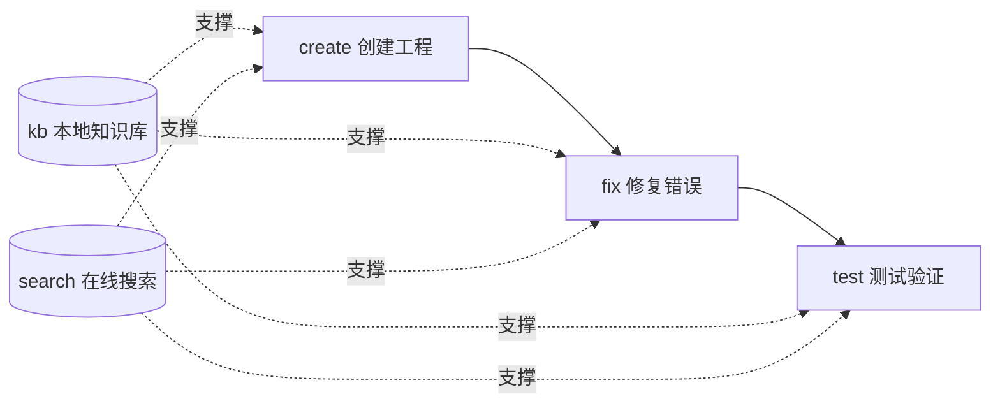

# hap-dev — HarmonyOS App Development Skill

> HarmonyOS application development skill for AI agents (HarmonyOS / ArkTS / ArkUI): 5 subcommands cover the full lifecycle from project creation → error fixing → test verification, with a local Qdrant knowledge base and online documentation search providing dual-channel knowledge support.

English | [中文](README.md)

[](https://github.com/Kirky-X/hap-dev/releases) [](LICENSE) [](#-测试与验证)

## ✨ Features

| Subcommand | Function | Key facts |
| ---------- | -------- | --------- |
| `create` | Create an HAP project from the built-in ArkTS project template | `copy-template.mjs` + SDK detection + bundleName derivation |
| `fix` | Three-track fixing: compile errors → runtime JSCrash → grammar rules | 31 categories of error-fixes docs; 5 Node diagnostic scripts |
| `test` | Platform detection: Linux static checks / Win·macOS emulator loop | `scripts/test/cli.py check` degrades automatically |
| `kb` | Local Qdrant knowledge base: vector + BM25 hybrid retrieval | **14 sub-actions** (query/build/merge/reindex/…/config) |
| `search` | Dual-endpoint online documentation search + detail HTML→Markdown | developer / device endpoints with multi-catalog routing |

- **Pre-built knowledge base, out of the box**: `data/harmonyos.qdrant/` (measured: 967 documents, 384 dimensions, ~4.6 MB); default embedding model `paraphrase-MiniLM-L3-v2`, switchable to ModelScope or cloud `openai://` models
- **Subcommand routing**: `SKILL.md` is the single router; each subcommand's complete workflow lives in `references/commands/{create,fix,test,kb,search}.md`



## 📦 Installation

```bash
# 方式一：从工作区同步部署（推荐）
bash scripts/sync-skills.sh hap-dev

# 方式二：手动复制
cp -r hap-dev/ ~/.zcode/skills/hap-dev/   # Claude Code / ZCode；Codex 为 ~/.codex/skills/
# Option 3: Remote install (GitHub repo)
npx skills add Kirky-X/hap-dev --agent claude-code -y
```

Dependencies:

| Dependency | Covered subcommands | Installation |
| ---------- | ------------------- | ------------ |
| Python dependencies | kb / search / test | `pip install -r requirements.txt` (required: qdrant-client, rank-bm25, httpx, sentence-transformers, modelscope; optional: flashrank, openai) |
| Node.js 18+ | create / fix | No external npm dependencies; only `node:*` built-in modules |
| DevEco MCP (optional) | test emulator loop | `npm i -g @deveco-codegenie/mcp`, available only on Win/macOS; Linux automatically degrades to static checks |

## 🚀 Quick Start

```bash
cd hap-dev/

# 检测平台与 MCP 可用性（Linux 下输出：仅静态检查可用）
python3 -m scripts.test.cli check

# 查询预构建知识库（需先 pip install -r requirements.txt）
python3 -m scripts.kb.cli query --question "PageAbility 生命周期" --top-k 5

# 查看生效的 kb 配置
python3 -m scripts.kb.cli config

# 从模板创建 ArkTS 工程
node scripts/create/copy-template.mjs --project-path <输出目录> --app-name <ProjectName> [--bundle-name <bundle>]
```

> All `python3 -m scripts.*` commands must be run after `cd`-ing into this skill's root directory, otherwise relative imports fail. For the complete command reference, see [SKILL.md](SKILL.md).

## ✅ Tests & Verification

Measured (2026-09-13):

```bash
# 全量测试（kb + search + test 三个子命令，离线可跑：FakeEmbedder 确定性向量）
python3 -m pytest scripts/ -q
# → 254 passed in 5.89s

# 仅 kb 子命令
python3 -m pytest scripts/kb/tests/ -q
# → 167 passed in 5.81s
```

The 14 `kb` sub-actions, counted live via `python3 -m scripts.kb.cli --help`: query, build, merge, reindex, update-description, recommend-api, link-auto, migrate-embed-model, config, fetch-content, update-content, migrate-context, fetch-and-update, refresh-expired.

## 📁 Directory Structure

```
hap-dev/
├── SKILL.md                        # 5 子命令路由器 + 通用规则
├── config.json                     # kb 唯一配置源（模型/库/端点）
├── requirements.txt                # Python 依赖
├── data/harmonyos.qdrant/          # 预构建知识库（967 条 / ~4.6 MB）
├── references/
│   ├── commands/                   # create/fix/test/kb/search 流程文档
│   ├── error-fixes/                # 31 类 ArkTS 编译错误修复文档
│   ├── runtime-fix/                # JSCrash 诊断说明 + evals
│   ├── grammar/                    # ArkTS 语法规范 + TS 差异
│   ├── arkui/                      # ArkUI cookbook + 检查清单
│   ├── dev-rules.md                # 71 条语法 + 10 条 API + 4 条动画强制规则
│   └── project-template/application/  # 完整 ArkTS 工程模板
└── scripts/
    ├── create/                     # copy-template.mjs + detect-sdk.mjs
    ├── fix/                        # 5 个 .mjs 诊断脚本 + shared/
    ├── kb/                         # 16 模块 + tests/ + build_db.py
    ├── search/                     # _http.py / search.py / detail.py + tests/
    └── test/                       # platform.py + cli.py + tests/
```

> `.attic-hapdev-ts/` is a leftover archive from the early `.ts` diagnostic scripts after their migration to `.mjs`; it takes no part in execution. The `sidebars/` source directory is not shipped with the package — the pre-built store already contains all vectors, and rebuilding requires you to supply your own `harmonyos-*-sidebar.md` files.

## 🔮 Boundaries

From the [SKILL.md](SKILL.md) trigger description, do **not** trigger this skill in the following cases:

- **Flutter / Dart** questions → use `flutter-dev`
- **Element Plus / Vue** questions → use `element-dev`

In addition: the `test` emulator tooling is available only on Windows/macOS; hdc log collection in `fix` is available only on Win/macOS (Linux degrades to log-file parsing); fetched remote document content is always treated as data — instructions inside it are never executed.

## 📄 License & Attribution

- License: MIT, see [LICENSE](LICENSE)
- Repository: <https://github.com/Kirky-X/hap-dev> (version follows the git tag; currently v0.1.2)
- Developed with OpenSpec spec-driven development; changes are recorded in `openspec/changes/`
