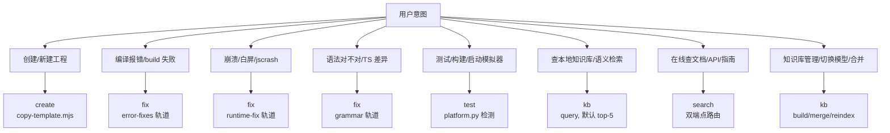
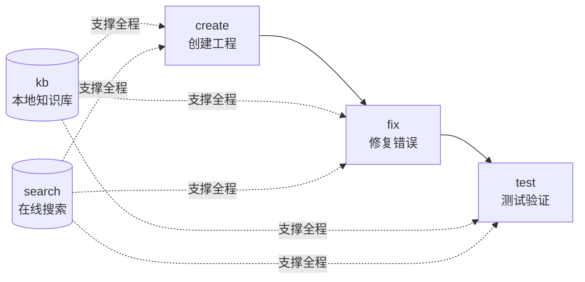

# HAP-DEV —— 鸿蒙应用开发技能

五个子命令覆盖鸿蒙应用开发全生命周期：create（创建工程）→ fix（修复错误）→ test（测试验证），辅以 kb（本地知识库）与 search（在线文档搜索）作为知识支撑。

- **create**（上游）— 基于 Node 脚本 `scripts/create/copy-template.mjs` 创建 ArkTS 工程，模板复制 + SDK 自动探测 + bundleName 派生 + main_pages.json/EntryAbility 同步。解决"工程**怎么起**"。
- **fix**（修复）— 聚合三套修复轨道：编译错误（21 类 error-fixes references）、运行时 JSCrash（5 个 Node 脚本 + faultlogger/hilog 证据链）、语法规范（grammar references）。按症状路由。解决"**错了怎么改**"。
- **test**（验证）— 平台检测 + 条件启用 DevEco MCP（@deveco-codegenie/mcp）。Linux 静态检查（check_ets_files/build_project）；Windows/macOS 模拟器全功能（start_app/UI 树/UI 操作/hilog/verify_ui 自然语言用例）。解决"**对不对**"。
- **kb**（知识库）— 本地 Qdrant 知识库，9 类 sidebar 文档分类存储，向量嵌入（默认 `paraphrase-MiniLM-L3-v2`，ModelScope/云端可切换）+ bm25 关键词索引 + 可选 FlashRank 重排。description 懒填充 + 向量回填 + 双向链接。子动作：query/build/merge/reindex/update-description/update-links/config。解决"**本地能查什么**"。
- **search**（在线搜索）— 双端点（developer.huawei.com + device.harmonyos.com）多 catalog 路由，HTML→Markdown 清洗。作为 kb description/链接填充的合法通道之一。解决"**网上有什么**"。

## 子命令路由

**TL;DR 决策树**(快速路由,完整流程见下表):

| 用户意图                                    | 子命令   | 完整流程                                                          |
| ------------------------------------------- | -------- | ----------------------------------------------------------------- |
| 创建 / 新建 ArkTS 工程（从零/脚手架）       | create   | [`references/commands/create.md`](references/commands/create.md) |
| ArkTS 编译失败 / 类型错误 / build 报错      | fix      | [`references/commands/fix.md`](references/commands/fix.md)        |
| 运行时崩溃 / jscrash / 白屏 / 闪退 / faultlog | fix      | [`references/commands/fix.md`](references/commands/fix.md)        |
| ArkTS 语法问题 / TS→ArkTS 差异 / 是否允许某语法 | fix   | [`references/commands/fix.md`](references/commands/fix.md)        |
| ArkUI 组件 / 布局 / 状态管理 / .ets UI 代码  | kb       | [`references/commands/kb.md`](references/commands/kb.md) + `references/arkui/` |
| 编译构建 / 启动应用 / 模拟器测试 / UI 验证   | test     | [`references/commands/test.md`](references/commands/test.md)      |
| 查询本地知识库 / 鸿蒙文档语义检索            | kb       | [`references/commands/kb.md`](references/commands/kb.md)          |
| 在线搜索鸿蒙文档 / 查 API 参考 / 查开发指南  | search   | [`references/commands/search.md`](references/commands/search.md)  |
| 知识库管理（构建/合并/重索引/切换模型）      | kb       | [`references/commands/kb.md`](references/commands/kb.md)          |

进入子命令后，按其流程文档执行。检查点、边界情形、交付核对清单均在各子命令文档内 —— **本路由器不含流程主体**。

## 通用规则

### 前置检查：DevEco MCP 配置（需求#3）

> 🔴 **CHECKPOINT**：运行此 skill 时，agent MUST 先检查 `@deveco-codegenie/mcp` 是否已配置完成。检查方式：询问用户或在 `~/.config/claude/claude_desktop_config.json`（或对应 runtime 的 MCP 配置文件）中查找 `deveco-codegenie` 条目。若未配置，需告知用户："检测到 DevEco MCP 未安装，test 子命令的模拟器全功能（start_app / UI 树 / verify_ui 自然语言用例 / hilog 采集 / save_ui_screenshot）将不可用，仅 Linux 静态检查（check_ets_files / build_project）可用。请执行 `npm i -g @deveco-codegenie/mcp` 并在 MCP 配置中注册后再使用模拟器测试功能。"

### 开发规则（ArkTS / API / ArkUI 动画）

`create` 子命令生成工程代码、`fix` 子命令的 grammar 轨道、`test` 的 `check_ets_files` 都 MUST 遵循 [`references/dev-rules.md`](references/dev-rules.md)。该文件包含三类强制规则：
1. **ArkTS / ets 语法约束**（71 条，违反 → 编译失败）
2. **HarmonyOS API 使用规范**（10 条必读）
3. **ArkUI 动画规范**（4 条，`animateTo` / `transform` / `renderGroup` / `opacity`）

### 平台检测（需求#3）
test 子命令经 `python3 -m scripts.test.cli check` 检测平台。Linux 仅静态检查；Windows/macOS 启用模拟器全功能。模拟器工具在 Linux 显式禁用并提示用户。

### config.json 驱动（需求#11）
`config.json` 记录 embed_model/rerank_model/db_path/endpoints。
- 文件缺失 → agent 经 AskUserQuestion 询问配置项；选默认则生成默认 config.json 并用预构建库；非默认则下载模型+重索引。
- embed_model 为默认值且 data/harmonyos.qdrant 存在 → 直接用预构建库，不重算向量。
- embed_model 非默认 → 下载模型 + 全量重索引。

> 🔴 **CHECKPOINT**：修改 `embed_model` / `embed_dim` 后 MUST 运行 `python3 scripts/kb/build_db.py` 全量重建向量库。未重建直接 query 会因维度不匹配报错。此规则同样适用于 `rerank_model` 切换后未 reindex 的情况。

### description 懒填充（需求#6）
kb query 命中文档但 description=="无描述"时，agent 调 `search detail <url>` 取正文 → 生成 ≤200 字 description → 调 `kb update-description <id> "<desc>"` 回填 + 重算向量。

> 🔴 **CHECKPOINT**：`kb merge` 完成后,新库需 `reindex --force` 刷新 description 变化文档的向量。**禁止**在未验证新库查询正确前删除旧库备份(需求#14)。备份文件 `.bak.<timestamp>` 需用户显式确认后才能删除。

## 完整流程链路

- **kb 与 search 协同**：kb query 命中无 description 文档 → search detail 取正文 → 回填 description + 提取相关推荐双向链接 → 后续 kb query 基于更丰富向量返回更准结果。
- **fix 与 search 协同**：fix 轨道遇到未知 API/错误 → search 在线查官方文档 → 补充修复依据。
- **test 与 fix 协同**：test 模拟器测试崩溃 → hilog/faultlog → 喂给 fix runtime-fix 轨道诊断。

## 失败模式与 fallback

| 触发条件 | 一线修复 | 仍失败兜底 |
| -------- | -------- | ---------- |
| config.json 缺失 | agent 经 AskUserQuestion 询问，选默认则生成默认配置 | 用户拒绝配置则停止，提示手动编辑 config.json |
| 预构建库不存在 | 调 `kb build` 从 sidebars/ 重建 | sidebars/ 缺失则提示用户从 temp/ 复制 |
| kb query 无结果 | 换关键词或调 `search` 在线搜索 | search 也无结果则建议直访 developer.huawei.com |
| search 端点失效 | 显式报错（不静默），建议检查网络 | 切换另一端点重试 |
| ModelScope 模型下载失败 | 重试 + 镜像源配置 | 提示用户手动下载或切换 openai:// 云端模型 |
| MCP 未安装（test） | 提示用户手动 `npm i -g @deveco-codegenie/mcp` | Linux 无需 MCP，仅静态检查可用 |
| fix 症状歧义 | 按 error-fixes → runtime-fix → grammar 顺序 fallback | 询问用户提供更明确症状 |

> 🔴 **CHECKPOINT**：fix 子命令的 runtime-fix 轨道执行 `hdc` 命令(faultlog/hilog 采集)前 MUST 确认目标设备序列号正确。`hdc -t <serial> shell ...` 误操作可能影响生产设备。Linux 平台 hdc 工具不可用,自动降级为日志文件解析模式。

## 禁止事项（反例黑名单）

1. **禁止硬编码模型名/路径** — embed_model/rerank_model/db_path 全部从 config.json 读，禁止脚本内硬编码。
2. **禁止跨子命令直连** — create 产出的工程不经 fix/test 验证不算完成；kb 的 description 回填不调 search detail 算违规。
3. **禁止简化实现** — 双向链接必须真正双向写入；description 回填必须重算向量；合并必须字段级 update_at 比较。
4. **禁止静默吞错** — 所有脚本错误显式上报（非零退出码/errors 字段/异常），不藏默认值背后。

## 平台支持矩阵

| 子命令 | Linux | Windows | macOS |
| ------ | ----- | ------- | ----- |
| create | ✅ | ✅ | ✅ |
| fix | ✅ | ✅ | ✅ |
| test（静态检查） | ✅ | ✅ | ✅ |
| test（模拟器） | ❌ | ✅ | ✅ |
| kb | ✅ | ✅ | ✅ |
| search | ✅ | ✅ | ✅ |
