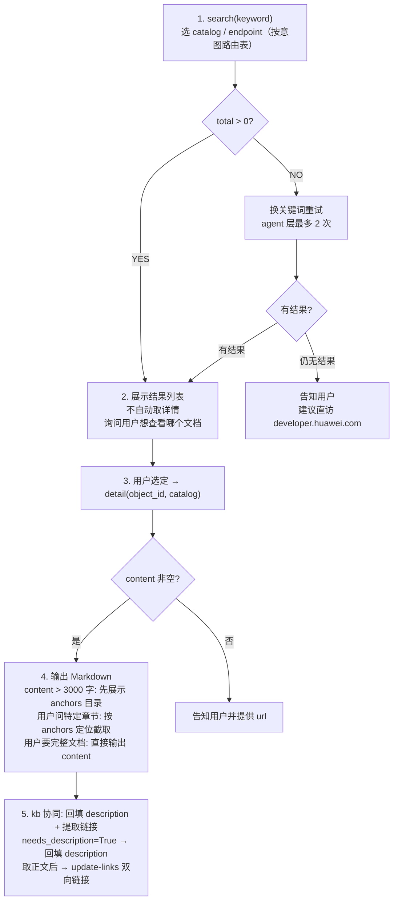

# search 子命令 —— 双端点在线文档搜索

双端点（developer + device）多 catalog 路由，HTML→Markdown 清洗。推荐经此子命令脚本访问文档正文（kb 的 description/links 回填也走此通道）。

> 🔴 **端点来源**：端点 host / path / catalog 列表从 `config.json` 的 `endpoints` 字段读，`scripts/search/_http.py` 提供常量与 fallback。本文档不重复硬编码 host/path，请以 `config.json` 为准。

## 双端点路由表

| 端点 | host 来源 | 用途 | 载荷特征 |
| ---- | ---- | ---- | ---- |
| `developer` | `config.json` 的 `endpoints.developer.host` | 应用开发文档；catalog ∈ {`best-practices`, `harmonyos-guides`, `harmonyos-references`} | 载荷含 `developerVertical.catalog` |
| `device` | `config.json` 的 `endpoints.device.host` | 设备开发文档；无 catalog 概念 | 载荷含 `harmonynorthVertical.categoryList` |

`developer` 端点的合法 catalog 列表见 `config.json` 的 `endpoints.developer.catalogs`（默认 `["best-practices", "harmonyos-guides", "harmonyos-references"]`，由 `_http.py` 的 `DEVELOPER_CATALOGS` 常量提供 fallback）。

## catalog 路由（按查询意图）

| 用户查询意图 | catalog / endpoint 参数 |
| ---- | ---- |
| 开发教程 / 步骤 / 方法 | `--catalog harmonyos-guides` |
| API 接口 / 属性 / 方法 / `@ohos.*` 模块 | `--catalog harmonyos-references` |
| 最佳实践 | `--catalog best-practices` |
| 设备开发 | `--endpoint device` |
| 不确定 / 综合 | 不指定（两个端点都搜） |

## 命令格式

### 搜索

```bash
python3 scripts/search/search.py <keyword> \
  [--catalog CATALOG] \
  [--endpoint ENDPOINT] \
  [--offset N] \
  [--length N]
```

参数：

| 参数 | 必填 | 默认 | 说明 |
| ---- | ---- | ---- | ---- |
| `keyword` | 是 | — | 搜索关键词，中英文均可 |
| `--catalog` | 否 | 不指定 | developer 端点 catalog 过滤；仅对 developer 端点生效 |
| `--endpoint` | 否 | 不指定（两个端点都搜） | `developer` 或 `device` |
| `--offset` | 否 | `0` | 分页偏移 |
| `--length` | 否 | `12` | 每页条数，最大 `100`（超过自动夹到 100） |

确定性路由规则（在 `_resolve_plan` 中实现，无模型判断）：

- `--endpoint device` → 仅查 device 端点（`--catalog` 被忽略，因 device 无 catalog 概念）。
- `--catalog <X>` → 仅查 developer 端点的 catalog X。
- `--endpoint developer` + 不指定 `--catalog` → 查 developer 所有 catalog。
- 都不指定 → 查 developer 所有 catalog + device 端点。

### 详情

```bash
python3 scripts/search/detail.py <object_id> <catalog_name>
```

参数：

| 参数 | 必填 | 说明 |
| ---- | ---- | ---- |
| `object_id` | 是 | 搜索结果的 `object_id` 字段（即文档 URL 末段） |
| `catalog_name` | 是 | developer 端点 catalog 之一（`best-practices` / `harmonyos-guides` / `harmonyos-references`） |

> detail 命令**仅** 支持 developer 端点 catalog；device 端点文档目前无 detail 接口。

> 🔴 **detail 是 search 子命令的正文获取通道**：`detail.py` 负责 HTML→Markdown 清洗与 anchors 提取，kb 的 description/links 回填都走此通道。

## 输出格式

### search 输出

```json
{
  "keyword": "搜索关键词",
  "offset": 0,
  "length": 12,
  "total": 5,
  "results": [
    {
      "name": "文档标题",
      "description": "摘要文本",
      "object_id": "详情ID",
      "catalog": "harmonyos-guides",
      "catalog_label": "指南",
      "language": "ArkTS",
      "kit": "所属Kit",
      "url": "文档URL",
      "anchors": [{"id": "锚点ID", "title": "章节标题"}]
    }
  ],
  "errors": []
}
```

`errors` 字段是字符串列表，记录 HTTP / API 失败（显式上报，**不静默吞错**）。`total=0` + `errors` 非空 + `results` 为空 → 脚本退出码 1；其余情况退出码 0。

### detail 输出

```json
{
  "title": "文档标题",
  "object_id": "xxx",
  "catalog": "harmonyos-guides",
  "language": "cn",
  "version": "V213",
  "anchors": [{"id": "锚点ID", "title": "章节标题"}],
  "content": "Markdown 格式正文，保留标题/代码块/列表/链接/表格/引用结构"
}
```

`content` 为完整 Markdown 正文，可直接向用户呈现。

## 分页

- `--offset` 默认 0。
- `--length` 默认 12，最大 100（超过自动夹到 100）。
- 翻页：`--offset 12 --length 12` 取第二页，依此类推。

## 锚点导航

`search` 与 `detail` 输出都含 `anchors` 字段（`[{id, title}]`）。

`detail` 返回的 `content` > 3000 字时，**先** 展示 `anchors` 目录让用户选章节，再按选定锚点截取相关段落。**不** 自动堆全部内容。

| 场景 | 处理 |
| ---- | ---- |
| 用户问特定章节 | 利用 `anchors` 定位，截取相关段落 |
| 内容很长（>3000 字） | 先展示 `anchors` 目录让用户选 |
| 用户需要完整文档 | 直接输出全部 `content` |
| 用户需要代码示例 | 重点展示代码块部分 |

## 错误处理

| 场景 | 现象 | 处理 |
| ---- | ---- | ---- |
| 搜索无结果 | `total: 0` | agent 层换关键词重试（**最多 2 次**）；建议缩短关键词、换英文术语、去掉版本号；仍为 0 告知用户 |
| 文档详情获取失败 | detail 返回 `error` 字段 | 提示文档可能下线，提供 search 结果中的 `url` 供直接访问 |
| 网络错误 | HTTPError / 连接失败 | **显式报告**，不静默；建议稍后重试 |
| `catalog` 参数错误 | argparse 校验失败 | 退出码 2；提示合法 catalog |
| API 限流 | 返回非 `00000` code | `errors` 字段记录；agent 层等待几秒后重试；持续限流建议用户直访 `developer.huawei.com` |
| 内容为空 | `content: ""` | 文档可能更新中；提供 `url` 让用户直接查看 |
| `object_id` 不存在 | detail API error | 确认 `object_id` 拼写；或重新 search 获取最新结果 |
| 全部端点失败 | `total=0` + `errors` 非空 + `results` 为空 | 脚本退出码 1；agent 显式上报所有 `errors` |

> 🔴 **CHECKPOINT**：脚本层**不重试**零结果响应（重试逻辑归 agent 层）。脚本只把错误显式写入 `errors` 字段。

## 工作流



> 文字步骤速查：1) search(keyword) 选 catalog/endpoint → 2) 展示列表让用户选 → 3) detail(object_id, catalog) 取正文 → 4) 输出 Markdown（长文档先给 anchors 目录）→ 5) kb 协同回填 description + update-links 双向链接。

## 关键词选择策略

- 优先用文档中可能出现的精确术语（如 `Navigation`、`FlashMode`）。
- 中英文均可；中文偏指南，英文偏 API 参考。
- `@ohos.*` 模块名直接作为关键词（如 `@ohos.multimedia.camera`）。
- 搜索无结果时：缩短关键词、换英文术语、去掉版本号重试。

## 与 kb 协同

`search detail` 是 `kb` 子命令 `description` 懒填充与链接提取的**唯一合法正文来源**：

- `kb query` 命中 `needs_description=True` 文档 → agent 调 `search detail <object_id> <catalog>` 取正文 → 生成 ≤200 字 description → `kb update-description` 回填。
- 同一正文 → `kb update-links --id <id> --content "<markdown>"` 提取双向链接。

详见 [`kb.md`](kb.md) 的"懒填充流程"与"update-links"章节。

## 与 fix 协同

`fix` 子命令遇到陌生 `@ohos.*` / `@kit.*` API 或不在 21 类错误表内的编译错误时：

- 调 `search` 在线查官方文档 → 补充修复依据。
- 不要凭模型记忆下结论。

## 边界情形

| 情形 | 处理 |
| ---- | ---- |
| 用户问 device 端点文档的详情 | device 端点无 detail 接口；提供 `url` 让用户直访 |
| `--endpoint device` + `--catalog X` | `--catalog` 被忽略（device 无 catalog 概念） |
| 用户未指定意图 | 不传 `--catalog` / `--endpoint`，两端点都搜 |
| `--length > 100` | 脚本自动夹到 100 |
| 结果过多（`total > 24`） | 建议用户缩小范围或指定 `--catalog` |
| `keyword` 为空 | argparse 报错，退出码 2 |
| 网络超时 | 显式 `errors` 上报，不静默 |

## 交付核对清单

### search 流程
- [ ] `keyword` 非空
- [ ] `--catalog`（若有）属于 `config.json` 的 `endpoints.developer.catalogs` 之一
- [ ] `--endpoint`（若有）为 `developer` 或 `device`
- [ ] `--offset` ≥ 0；`--length` 在 1-100 之间
- [ ] 结果展示后**不自动取详情**，等用户选
- [ ] `total=0` 时 agent 层换关键词重试（最多 2 次），仍 0 则告知用户

### detail 流程
- [ ] `object_id` 来自 search 结果（非手动编造）
- [ ] `catalog_name` 属于 developer 端点合法 catalog 之一
- [ ] `content` 为空时提供 `url` 让用户直访
- [ ] `content > 3000` 字时先展示 `anchors` 目录

### 端点 / host 来源
- [ ] 端点 host / path 来自 `config.json` 的 `endpoints` 字段或 `_http.py` 常量
- [ ] 文档无硬编码 host / path

### 与 kb 协同
- [ ] `kb query` 命中 `needs_description=True` 时已调 `search detail` 取正文
- [ ] 取正文后已用 `kb update-description` 回填 + `kb update-links` 提取双向链接

### 错误处理
- [ ] 网络错误 / API 限流 / `errors` 非空时已显式上报，未静默吞错
- [ ] 全部端点失败时已用退出码 1 检测并上报所有 `errors`
